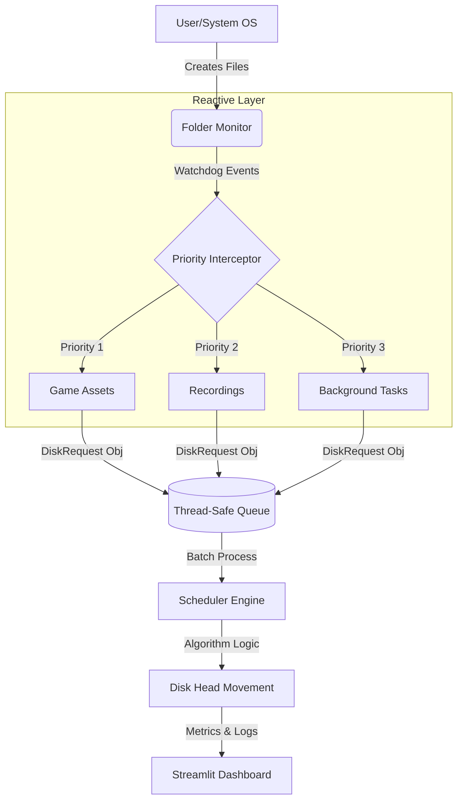
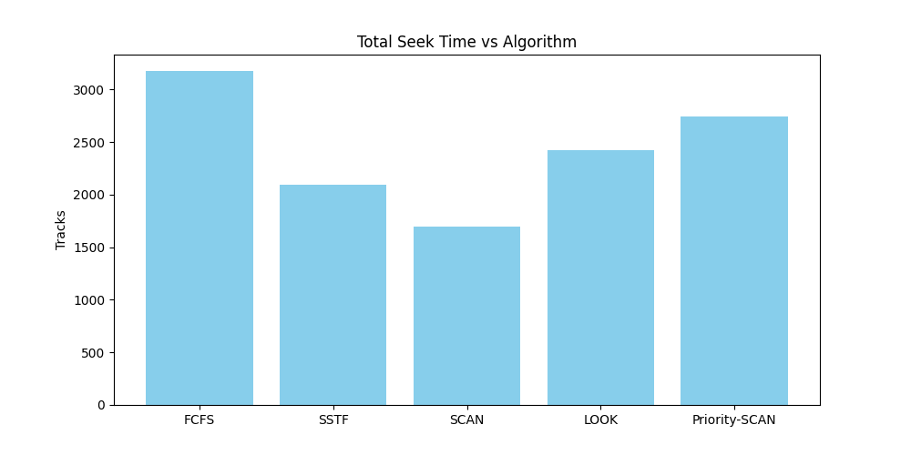
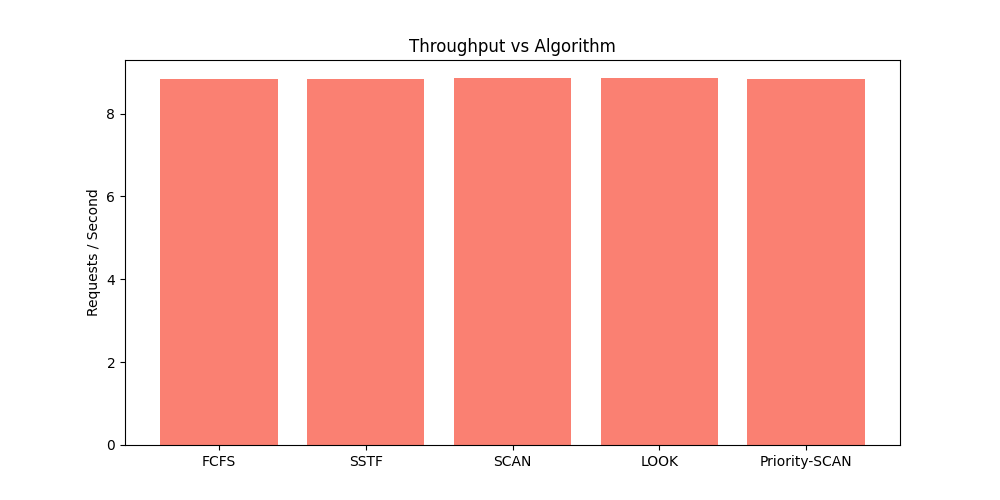

# 🎮 Real-Time Priority-Aware Disk Scheduler
### *Optimizing Disk I/O for High-Performance Gaming Environments*


---


## 🌌 Overview
In modern gaming, **stuttering** and **frame drops** are often caused by background processes (like Windows Updates or file backups) fighting for Disk Head access while a game attempts to stream high-resolution textures.

This project implements a **Priority-Aware Disk Scheduling Engine** that intercepts file events in real-time. By monitoring specific system folders, it dynamically re-prioritizes disk requests, ensuring that **Game Assets** always receive the lowest latency, even if background tasks are flooding the queue.

---

## 🚀 Key Features

-   **📡 Live Folder Monitoring**: Uses `watchdog` to intercept file creation and modification events across three distinct priority zones.
-   **⚡ Priority-SCAN Algorithm**: A custom implementation that preempts background sweeps to service critical gaming requests immediately.
-   **📊 Interactive Dashboard**: A Streamlit-based UI featuring:
    -   Live Disk Head Path visualization.
    -   Real-time performance metrics (Seek Time, Wait Time, Throughput).
    -   Instantaneous inter-algorithm comparison.
-   **🧪 Multi-Algorithm Simulation**: Test your workload against **FCFS**, **SSTF**, **SCAN**, **LOOK**, and our **Priority-SCAN**.

---

## 🛠️ System Architecture



---

## 📈 Performance Analysis

Our testing demonstrates that **Priority-SCAN** significantly reduces wait times for critical gaming files compared to traditional algorithms like SCAN or SSTF.

### Comparative Metrics
| Algorithm | Avg. Wait Time (High Load) | Disk Head Efficiency | Starvation Risk |
| :--- | :--- | :--- | :--- |
| **FCFS** | Very High | Poor | Zero |
| **SSTF** | Low (localized) | High | **High** |
| **SCAN** | Moderate | Very High | Zero |
| **Priority-SCAN** | **Ultra-Low (Game Assets)** | High | Low (Aging needed) |

<div align="center">
  <table>
    <tr>
      <td><b>Seek Time Comparison</b></td>
      <td><b>Throughput Analysis</b></td>
    </tr>
    <tr>
      <td></td>
      <td></td>
    </tr>
  </table>
</div>

---

## ⌨️ Installation & Setup

1.  **Clone the Repository**:
    ```bash
    git clone https://github.com/your-username/gaming-disk-scheduler.git
    cd gaming-disk-scheduler
    ```

2.  **Install Dependencies**:
    ```bash
    pip install -r requirements.txt
    ```

3.  **Setup the Gaming Environment**:
    Create the target directories on your storage drive (default: `C:/Gaming_System`):
    - `C:/Gaming_System/Game_Folder`
    - `C:/Gaming_System/Recording_Folder`
    - `C:/Gaming_System/Background_Folder`

4.  **Launch the System**:
    ```bash
    streamlit run app.py
    ```

---

## 📘 Theoretical Background

### Why Priority-SCAN?
While standard algorithms prioritize physical proximity (SSTF) or movement efficiency (SCAN), they lack **Contextual Awareness**. In a PC gaming environment, a 50ms delay in loading a texture is a "missed frame," while a 500ms delay in a background log update is "unnoticeable." 

Our engine treats **Folder Origin** as a proxy for **QoS Level**, allowing the OS to make smarter mechanical decisions.

---

## 📜 Project Structure
- `app.py`: Streamlit Dashboard & UI Logic.
- `algorithms.py`: Core Scheduling Engines (SSTF, SCAN, etc.).
- `monitor.py`: Real-time `watchdog` surveillance.
- `models.py`: Disk request and metadata schemas.
- `metrics.py`: Statistical calculation engine.

---

## 🤝 Contributing
Contributions are welcome! Please open an issue or submit a pull request for any improvements or bug fixes.

---

## 📄 License
This project is licensed under the MIT License - see the [LICENSE](LICENSE) file for details.

---

<p align="center">
  Built with ❤️ for the OS Project (Sem 4)
</p>
